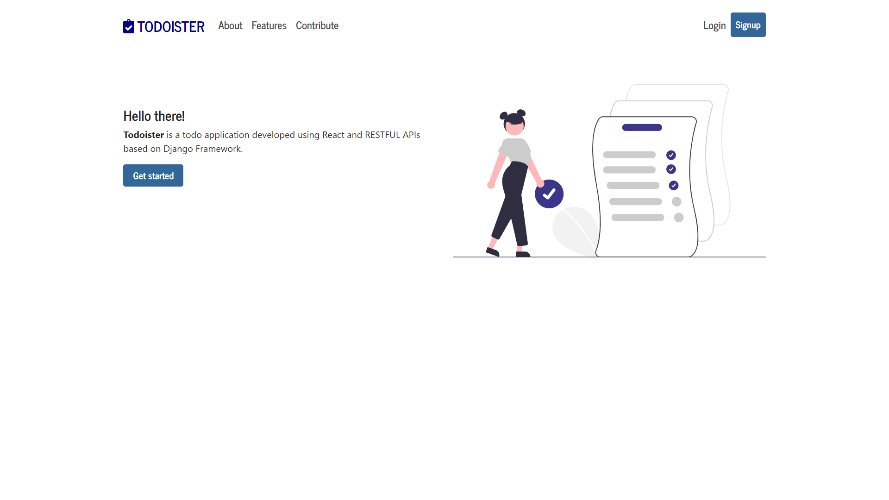
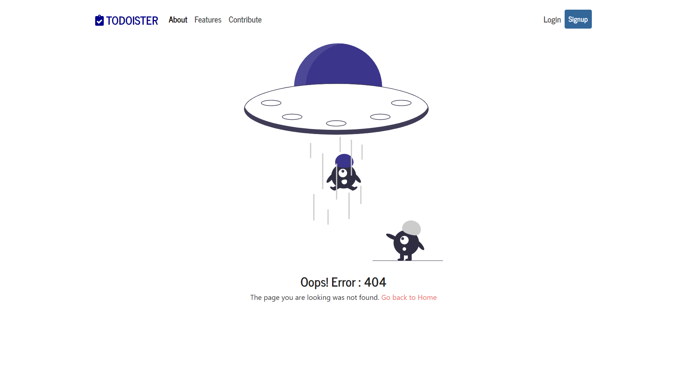
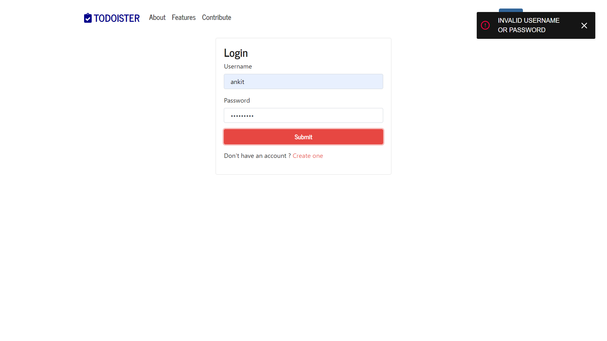
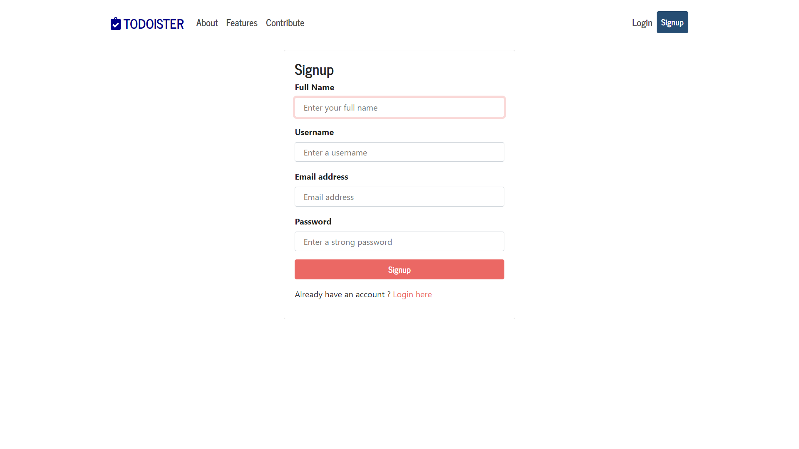
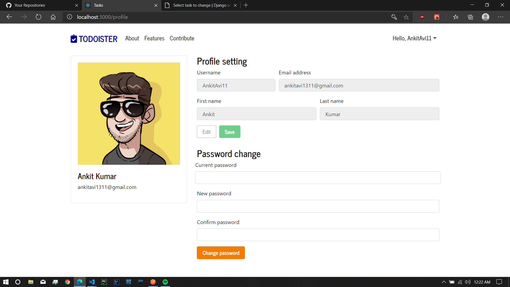
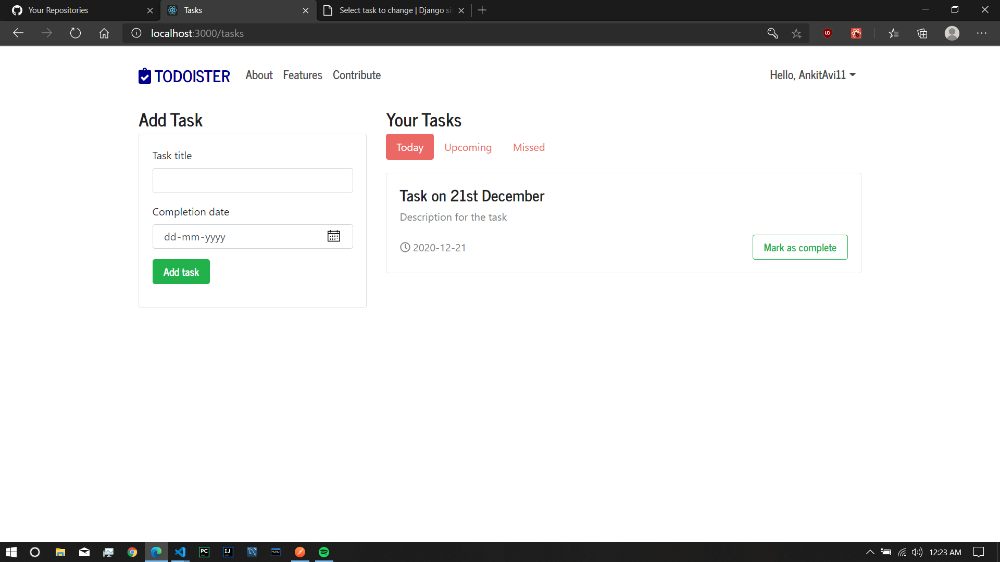
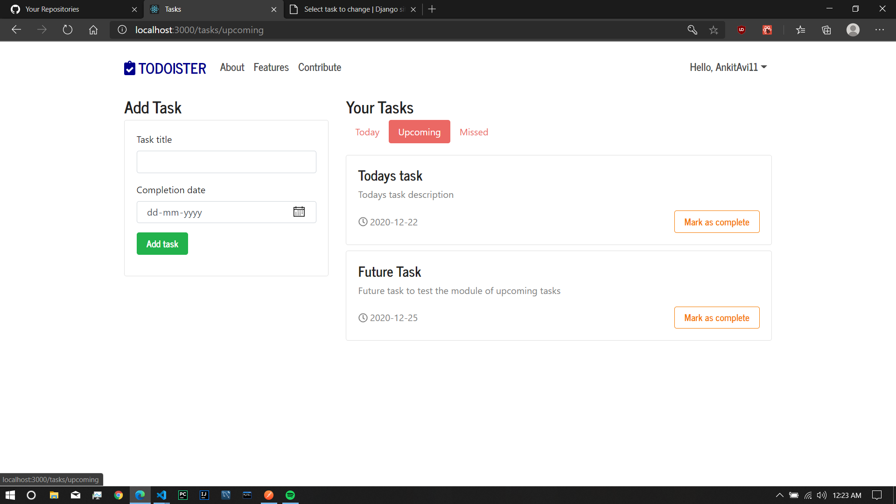
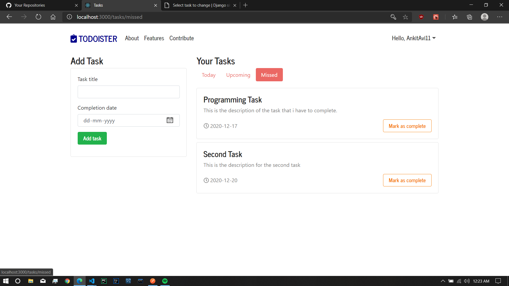
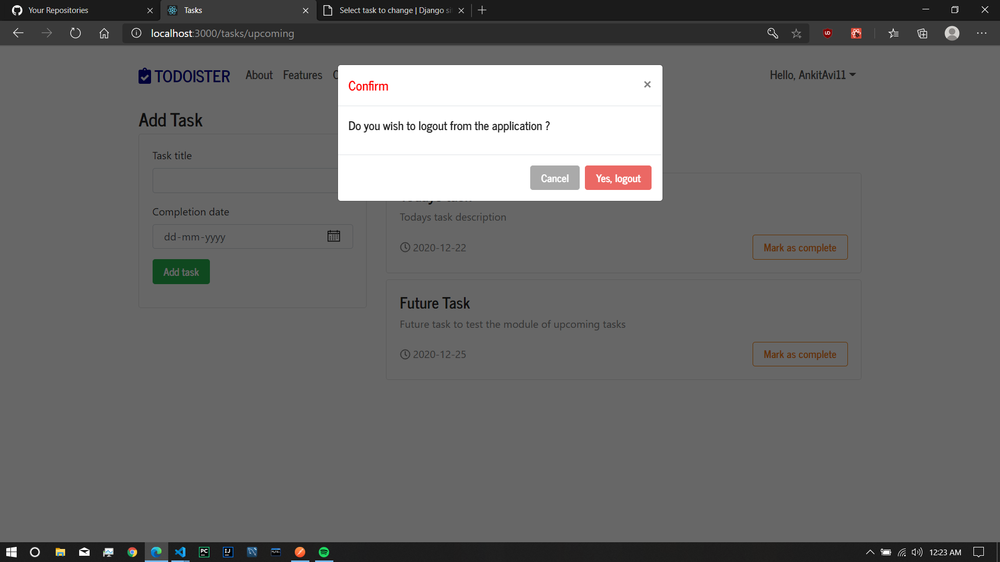

### Todoister 
Todo app using React at the front and Django at the backend.
This app is a demo to demostrate the use of the REST API I am working that will help the beginner programmers to build a full fledged application without dealing with the backend.

### Features
- Login Feature added with redux. 
- Proper redirecting of user if already loggedin and when not loggedin. 
- React alerts to display toast messages added

### Home Screen

### page not found screen

### Login screen with alert message demo

### Register screen

### User profile setting

### Tasks

### Upcoming tasks

### Completed tasks

### Logout
